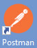
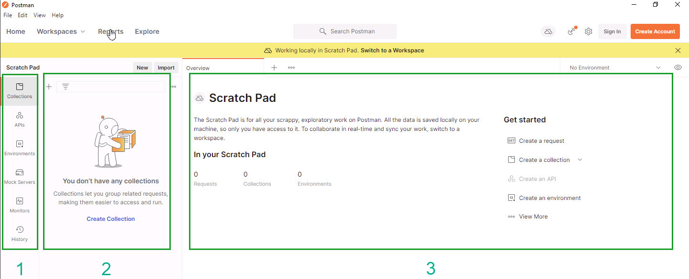

# Exploring Postman

Start the Postman application

When Postman loads you are placed staight into the Collections window.  Collections allow you create groups of objects like API requests in the order you wish them to be.  Skillable provide a Collection of objects for all the Skillable LOD API requests.  

The picture above shows the 3 main working areas or Postman:
1. The application primary functions - we will only be using collections
1. The Panel related to the Function
1. The details related to the function when run.

###Lets register the Skillable collection.

- [] From just above the **Collections** panel click the Import button:
- [] Click Link
- [] enter the following link into the box: +++https://docsmirror.blob.core.windows.net/learnondemandsystems-docs-master/lod/lod-api/lab-on-demand.postman_collection.json+++
