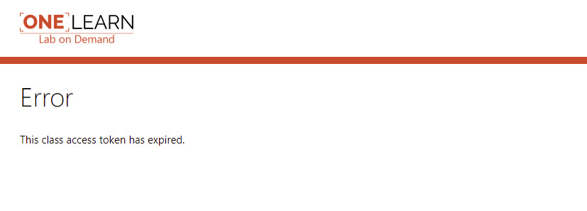
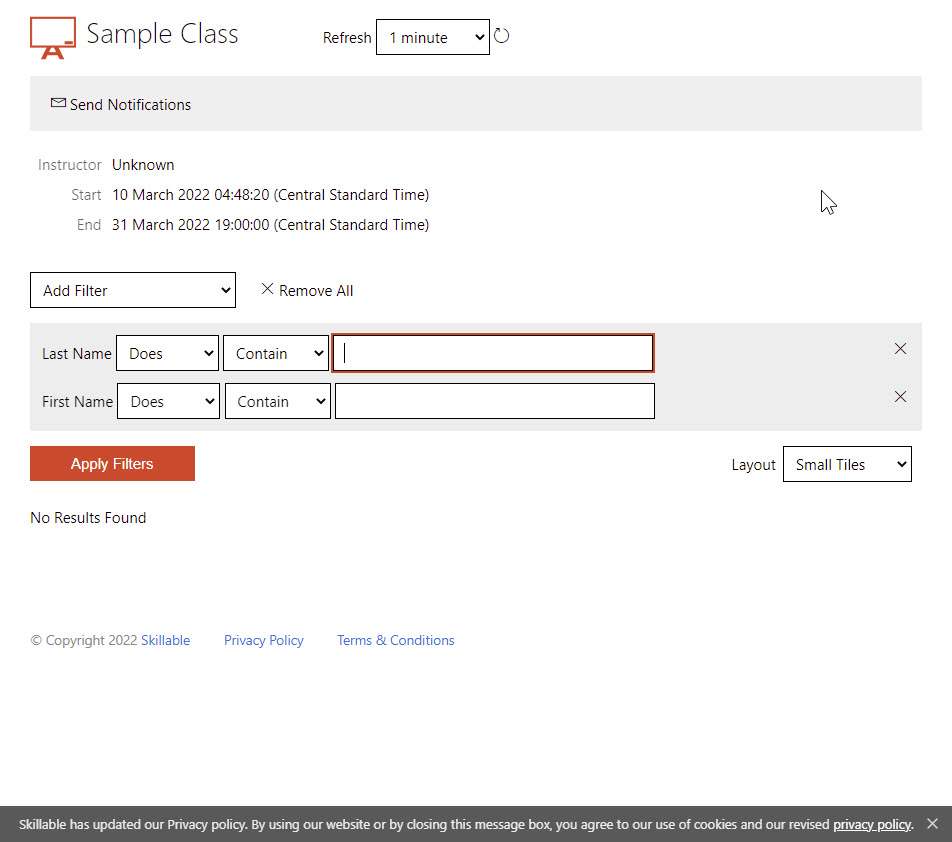

### Lets setup Instructor Monitoring

This will use the [**ClassAccessUrl**](https://docs.skillable.com/lod/lod-api/lod-api-class-access-url.md) API Call.

 - [] Within Postman select the GET ClassAccessUrl API call
 - [] Notice this API call takes one parameter.  The ID value set for the Class in the previous request.  Use the value @lab.LabInstance.ID

- [] Enter the API Key details

| KEY | VALUE |
|-----|-------|
|+++api_key+++|+++@lab.Variable(api_key)+++|

- [] Press the Send buttonand wait for the response.  
- [] Save this API command as +++LDW - ClassAccessUrl+++ in the **@lab.Variable(initials)-LDW Collection**
- [] Notice the URL returned in the response.  Copy the URL and open in a web page on your local machine.  You should see the screenshot below.  If you have used or seen lab monitoring in the TMS this should be familar.

>[!TIP]
What if I get **Error** This class access token has expired.

>

  Remeber the web links are single use time limited so if too much time passed between receiving the link and connecting to it the link will expire.  You will need to run the Postman request again.
  
  

  
  

Press **Next** to continue
